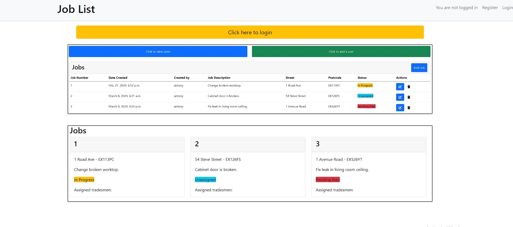

# Job List

Organising your companies jobs, so you don't have to

The last update to this file was: **March 10th, 2024**

## Contents

[Design](#design)

- [The Strategy Plane](#the-strategy-plane)

- [The Scope Plane](#the-scope-plane)

- [The Structure Plane](#the-structure-plane)

- [The Skeleton Plane](#the-skeleton-plane)

- [The Surface Plane](#the-surface-plane)

[Agile Methodology](#agile-methodology)

[Features](#features)

- [Existing Features](#existing-features)

- [Future Features](#future-features)

[Languages](#languages)

[Frameworks and Libraries](#frameworks-and-libraries)

[Tools and Technologies](#tools-and-technologies)

[Testing and Validation](#testing-and-validation)

[Bugs and Fixes](#bugs-and-fixes)

[Deployment](#deployment)

[Cloning this repository](#cloning)

[Forking a branch](#forking)

[Credits](#credits)

[Acknowledgements](#acknowledgements)

## Design

### The Strategy Plane

#### Target User Group
Construction companies with at least two admin staff and at least ten tradesman.

- This website will benefit construction companies that deal with repairs, maintenance and insurance jobs.
- Ideal for teams that require a variety of trades for a variety of jobs.
- Tradesman that can attend multiple jobs in one day, without the need of asking job details every time.
- Teams that attend the same job multiple times with different people.

#### Problem Background
When I was working as a repairs carpenter for social housing, we had to use an app to load our jobs down into. This sounds like a good idea, but it was clearly designed by people who aren't going to use the app, and approved by people that also aren't going to use the app.

The problem with this is when people like me had to use the app every day, it didn't work in the best way. Our jobs only displayed for us one at a time, so there was no room for forward planning, the planners or tradesman couldn't set tasks on each job to keep up with the progress, and the tradesman couldn't change any incorrect details for the job.

The app was designed by people that were guessing what a tradesman needed, rather than asking the people who were going to use it.

#### Problem Statement

“I am a tradesman who is trying to be efficient with my work and progress jobs to completion whilst maintaining high standards, but I am being slowed down by my app.”

#### Project Aim

This project aims to provide tradesman and planners at construction companies a fully functioning app that gives both users the data customisation required to enable them to keep jobs updated which will increase efficiency.

[Return to contents list](#contents)

### The Scope Plane

The scope of this project is provided by user stories, organised below by epic and then role. 

Please note that some of the user stories below are not currenlty implemented. See [Product Backlog](#product-backlog) for a list of user stories not completed and [Future Features](#future-features) for further details on what is to come next.

#### EPIC - USER STORY: Register user.

View User Stories

As a **new user** I can register my account with the system so that a planner can register me as a tradesman.

 - Sign up using name and password.

#### EPIC - PLANNER STORY: Account Registration

View User Stories

As a **planner** I can register new users so that they can login and use the system.

As a **planner** I can register a new user, either planner or tradesman.

As a **planner** I can add a users role (planner or tradesman) so they receive the appropriate features.

As a **planner** I can register a new users different trades and certifications so they can be assigned the correct jobs.

As a **planner** I can optionally upload a profile image for the new user.

As a **planner** I can register the users first and last name.

As a **planner** I can register the new users emergency details, such as next of kin name and phone number, as well as any medical conditions.

As a **planner** I can register the new users contact information, such as email, address and phone number(s).

#### EPIC - PLANNER STORY: View user details

View User Stories

As a **Planner** I can view a paginated list of users on one screen.

As a **Planner** I can quickly see the users picture, name, phone number, role and any trades they have registered.

As a **Planner** I can click on a user to see a full page of all their details.

As a **Planner** I can edit a users details.

#### EPIC - PLANNER STORY: Create a job

View User Stories

As a **Planner** I can create a new job so that it can be sent to the tradesman.

As a **Planner** I can fill out the required information about the job.

As a **Planner** I can fill out the required information about the jobs contact details.

As a **Planner** I can add tasks to the job which includes assigning trades.

As a **Planner** I can edit or delete tasks that are already on the job.

As a **Planner** I can view the jobs status depending on if tasks are set and what progress they have made

#### EPIC - PLANNER STORY: View and edit an existing job.

View User Stories

As a **Planner** I can view and edit an existing job so that the current status can be seen and the content can be edited.

As a **Planner** I can load the jobs detail page and edit the different categories.

#### EPIC - TRADESMAN STORY: View jobs

View User Stories

As a **Tradesman** I can view a list of jobs, or individual job details so that I can attend the job and update the tasks on the job.

As a **Tradesman** I can view all the jobs on the system

As a **Tradesman** I can filter the jobs by trade and status

As a **Tradesman** I can click on a job to view its full details page

As a **Tradesman** I can edit a jobs details if they require updating

As a **Tradesman** I can add tasks to a job.

As a **Tradesman** I can edit or delete tasks on a job.

### Still in progress

#### EPIC - TRADESMAN STORY: Complete the risk assessment
This story will be implemented as a future feature by creating a new risk assessment model and form, and being attached to each job.

View User Stories

As a **Tradesman** I can view the jobs specific risk assessment so that I know what risks have been found.

As a **Tradesman** I can load the current risk assessment if there is one.

As a **Tradesman** I can edit and change the current risk assessment.

As a **Tradesman** I can create a new risk assessment.

#### EPIC - PLANNER STORY: Add appointments
This story will be implemented in the future as a feature to set dates in a calender for each tradesman to attend

View User Stories

As a **Planner** I can add appointments onto jobs so that the tradesmen can see their future jobs

As a **Planner** I can add an appointment and choose which tradesmen will attend.

As a **Planner** I can choose the time for the appointment.

As a **Planner** I can choose what criteria will be met for each appointment.

As a **Planner** I can send an email to the customer to confirm.

[Return to contents list](#contents)

---

### The Structure Plane

#### Website flow

The flow of the website depends entirely on the users role.

#### Not signed in:

If you're not signed in, you will have two options from the landing page.
- Login
- Register

This is to ensure the data is protected from anyone who isn't authorised.

#### Tradesman:

    Landing

As a tradesman when you first log in there will be a call-to-action button prompting you to enter the website. This will then take you to the tradesman home page.

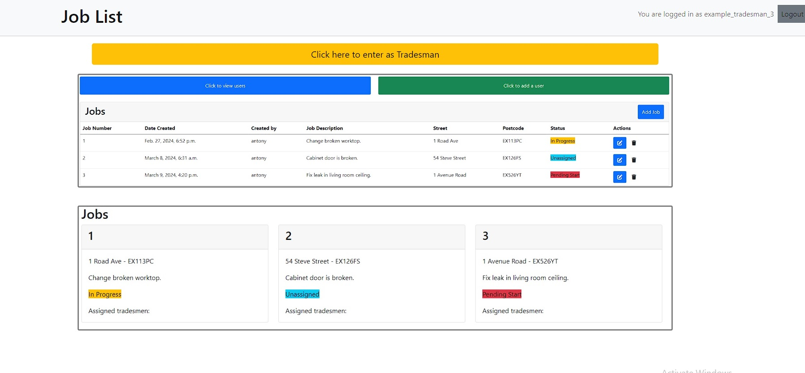
#### Wireframes
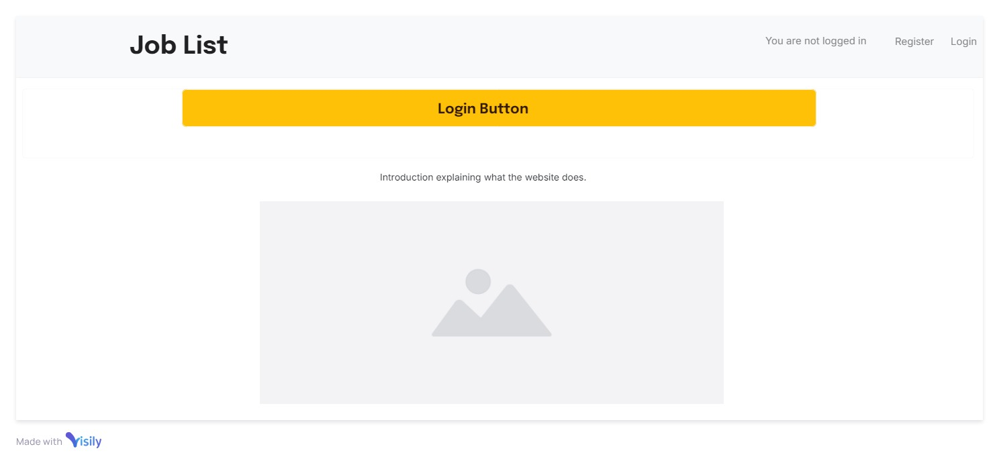
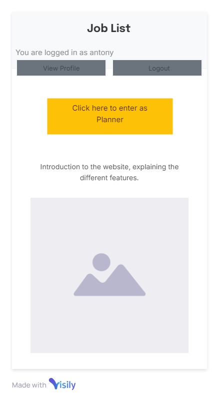

Tradesman Home

On this page you can view all the different jobs on the database, and specifically:
- The job number
- The first line of address and postcode
- The job description
- The status

This information was chosen to be displayed on each card as it's the information the other tradesman and I would always need to see first when I worked as a carpenter. 
- The job number - For any materials being ordered on accounts.
- The first line of address and postcode - So we knew where to go.
- The job description - We know what we're doing.
- The status - So we know if the job has been started yet.

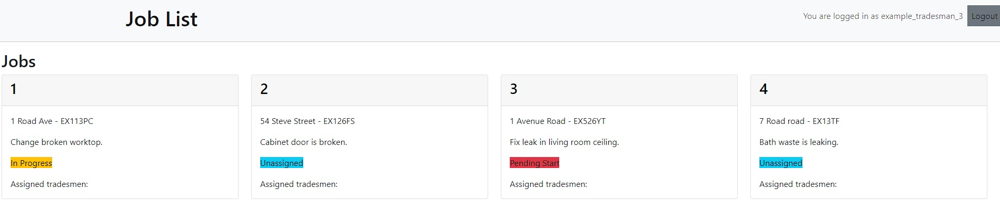
#### Wireframes
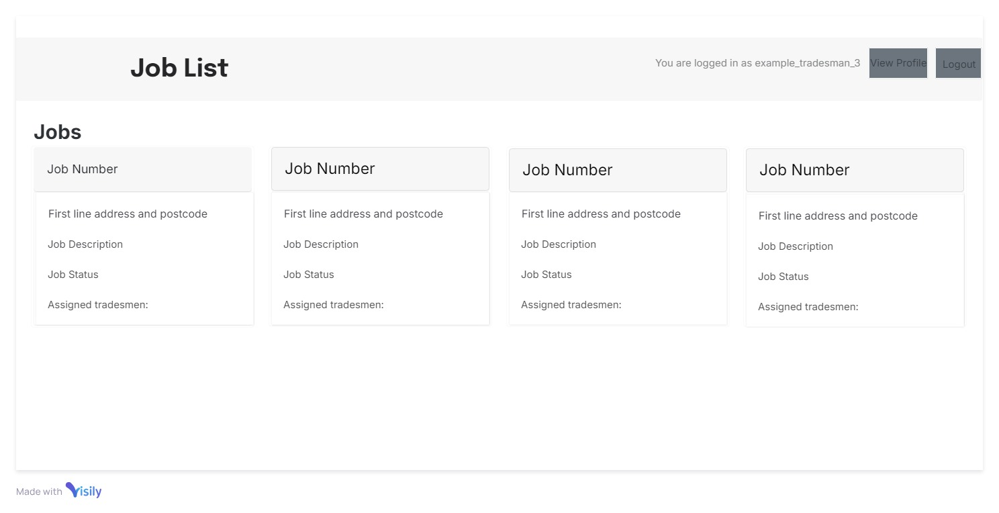
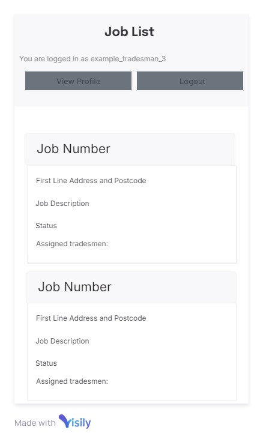

Job Detail

On this page you can view all the jobs data from the database, and specifically:
- Status
- Created by
- Created on
- Description
- Contact Details
- Name
- Phone number
- Other phone number
- Email
- Street
- Town/city
- County
- Postcode
- Any tasks that have been added.

On this page the tradesmen are able to edit the contact details of a job, add a task, edit a task and delete it, enabling CRUD functionality to the page. From here a tradesman will be able to view all the details they need for each job, as well as the tasks that have already been completed, and what needs to be completed. This is useful as it will prevent a tradesman going to a job, just to find out another trade needs to attend first.
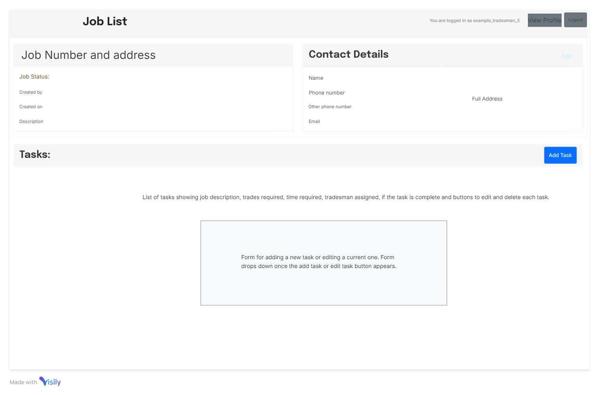
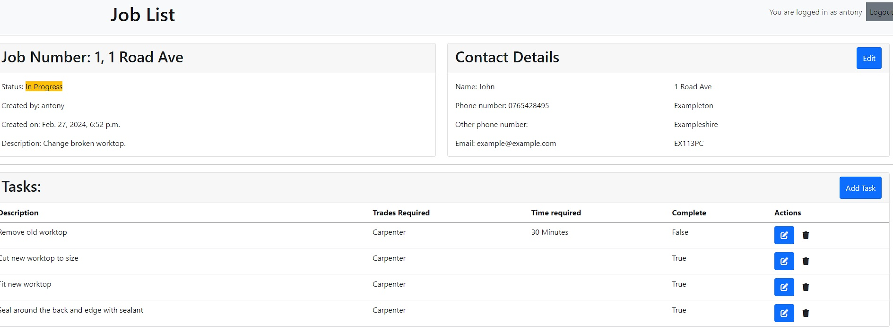
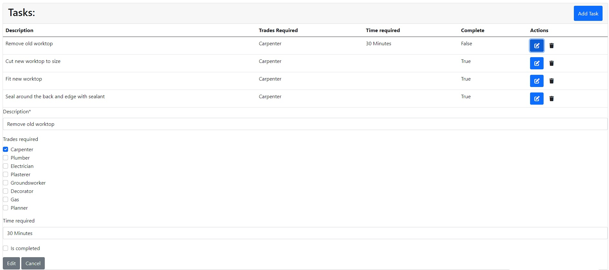

#### Wireframes

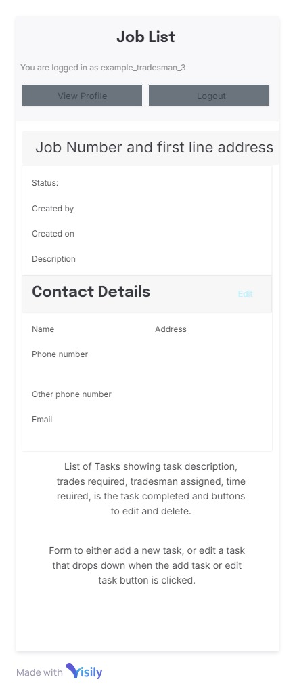

#### Planner:

    Landing

As a planner when you first log in there will be a call-to-action button prompting you to enter the website. This will then take you to the planner home page.

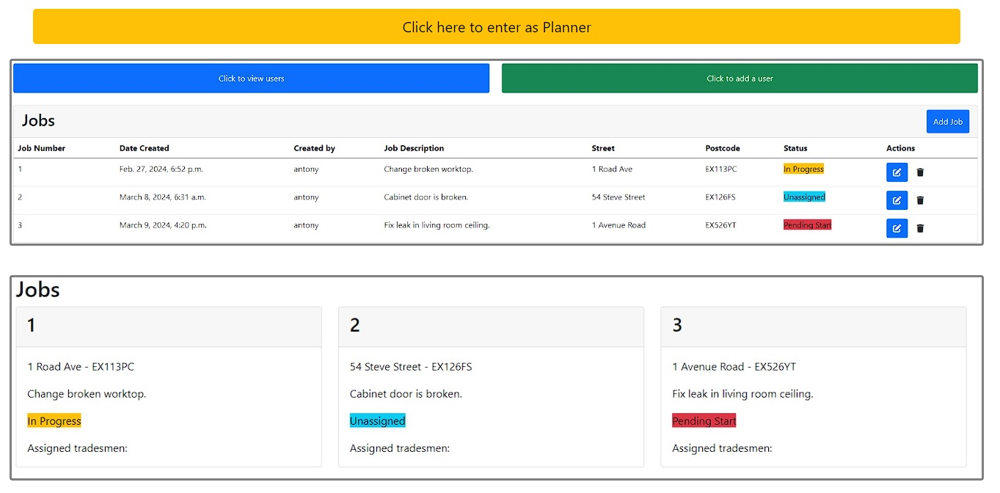

#### Wireframes

Planner Home

At the top of the page there are two buttons, allowing the planner to view the users or add a new user.

Underneath the planner can view all the different jobs on the database, and specifically:
- Job Number
- Date Created
- Created by
- Job Description
- Street
- Postcode
- Status

The planner can click on any job to get the details, or they can click the edit and delete buttons for CRUD functionality on each job

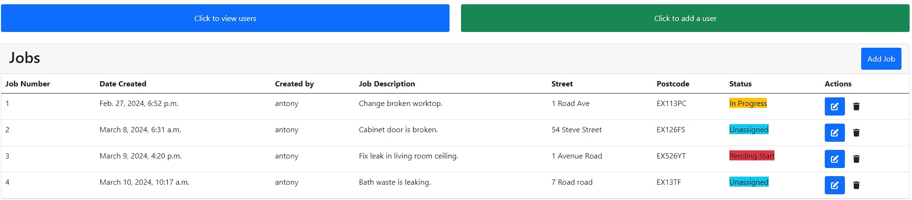
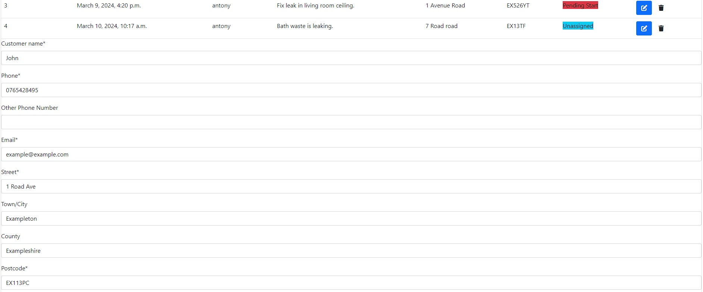
#### Wireframes
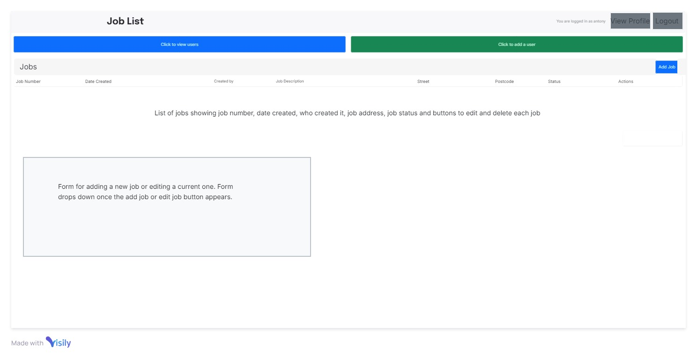
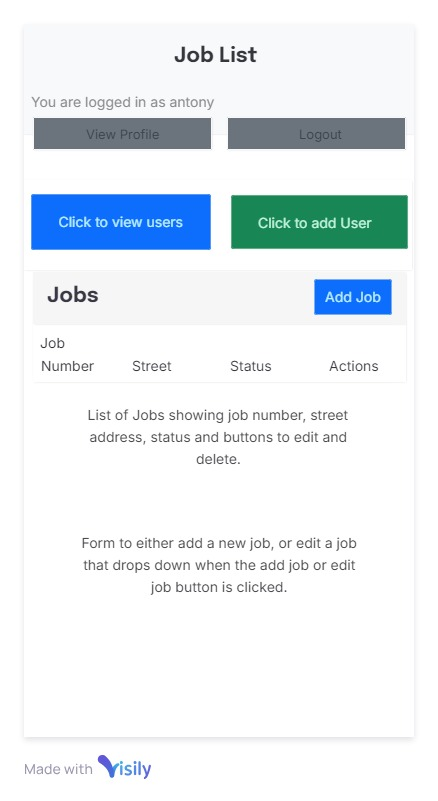

View Users

On this page the planners can view each user and the following details:
- Picture
- Name
- Phone
- Role
- Trades (if they are a tradesman)

These details were chosen as they are the details a planner might imidiately require, without having to open the full page.

From here the planner can click on a user to pull up the user detail page. Here the planner can edit each user and view all the details for them.

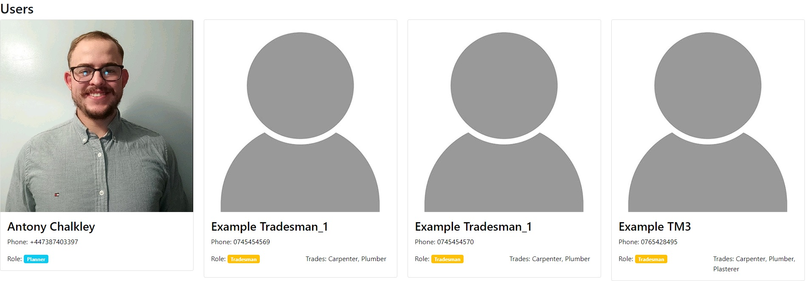
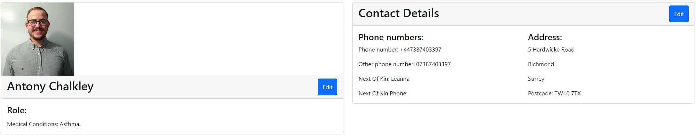
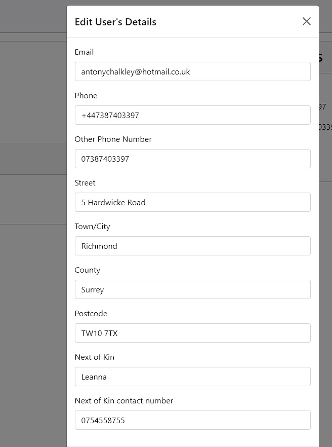

#### Wireframes
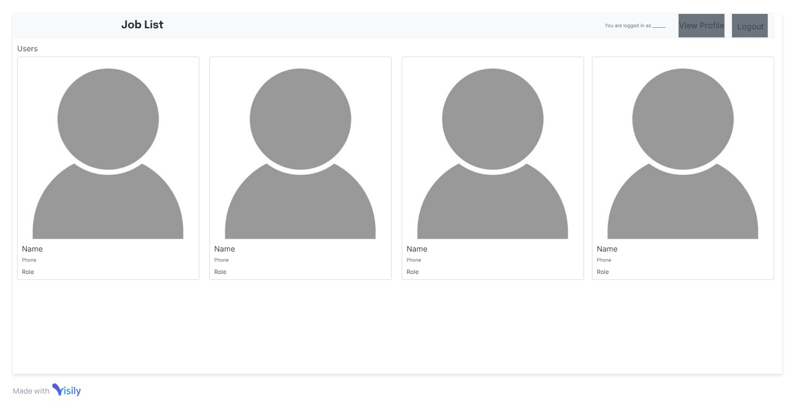
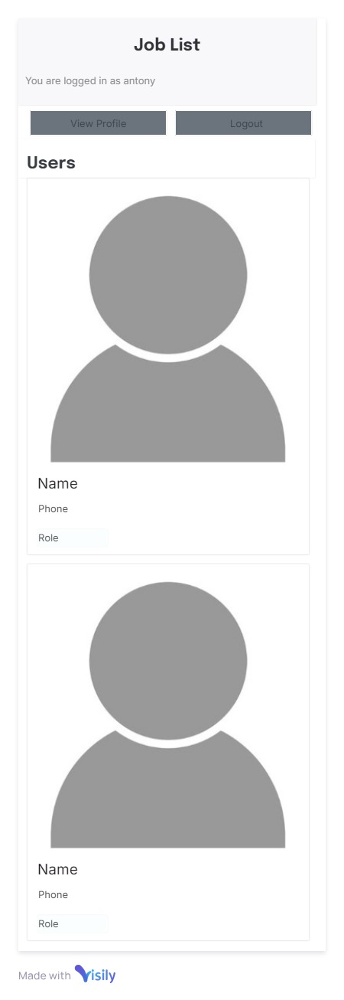

Add User

The add user page is for the planners to register a user from the all auth user model, with all the details the system requires for them. This page includes a crispy form with all the details from the UserProfile model.

I couldn't edit the allauth models, so I used a foreign key field to link one user to one userprofile.

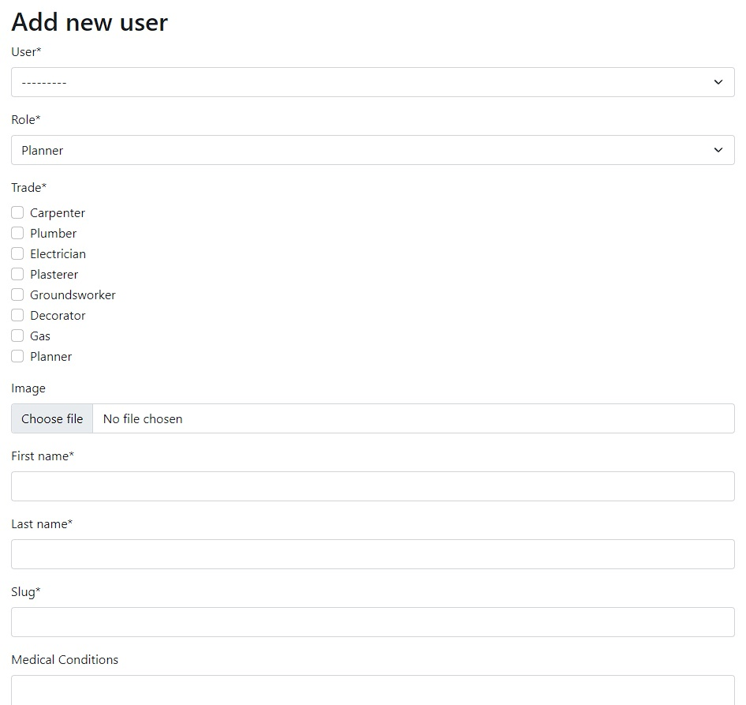

#### Wireframe
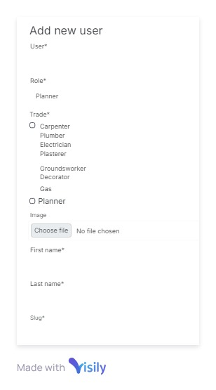

Job Detail

On this page you can view all the jobs data from the database, and specifically:
- Status
- Created by
- Created on
- Description
- Contact Details
- Name
- Phone number
- Other phone number
- Email
- Street
- Town/city
- County
- Postcode
- Any tasks that have been added.

On this page the planners are able to edit the contact details of a job, add a task, edit a task and delete it, enabling CRUD functionality to the page. From here a tradesman will be able to view all the details they need for each job, as well as the tasks that have already been completed, and what needs to be completed.

#### Wireframes

### The Surface Plane

As this website is based more towards the functionality as opposed to the style, I have focused more on implementing features. This means I have kept a simple view, relying mostly on boostrap styles.

#### Base colours
I have kept a white background with light grey features on the cards and header. This is because the website is going to be used frequently, so I want to keep it simple to increase efficiency.

#### Fonts
All the fonts have been kept the same, as this font provided by bootstrap is easy to read.

#### Icons
I have used the edit icon and bin icon for the edit and delete buttons on each job and task, this allows the user a visual aid to understand the use of each button.

#### Buttons
The buttons on the page hold the most colour, this is so the user will find it easy to see what the next step in the process is, enabling them to move quickly through the website when working.

[Return to contents list](#contents)

## Agile Methodology

During the creation of this project I have applied Agile where they fit into a solo project built purely for buisness purposes.

In particular the following common Agile practices have been followed:
user stories and product backlog, time boxing, prioritization and information radiators.

### User Stories

Please see the [Scope Plane](#the-scope-plane) for the user stories created for this project which breakdown the Epics which point out each feature and their functionality requirements.

The issues tool on GitHub has been used to record all user stories. Acceptance criteria and tasks were added to the user stories as the project progressed.

### Product Backlog

I utilized a product backlog to house all user stories before allocating them to an iteration. Any unfinished user stories by the iteration's end were returned to the backlog. After completing the project, two user stories remained in the product backlog, which are detailed in the [future features](#future-features) section of the readme.

You can access the product backlog on GitHub via a designated backlog column on the project board.

#### Final Backlog

See details

After the completion of the project, the following user stories remained in the backlog to be implemented in the future. Please see [Future Features](#future-features) for more details.

TRADESMAN STORY: Complete the risk assessment #17
PLANNER STORY: Add appointments #20

### MoSCoW Prioritisation

MoSCoW prioritisation was used throughout the project. At the beginning of each new iteration the project backlog was assessed and each user story categorised for the current iteration (not the project over all), thus allowing for the correct balance of prioritisation for each iteration. This process was repeated for each new iteration, being mindful at all times of the overall remaining project time left.

- **Must Have** the user stories deemed vital for this iteration of the project.

- **Should Have** the user stories deemed important but not vital for this iteration of the project.

- **Could Have** the user stories that will only have a small impact if left out of this iteration of the project.

- **Won't Have** the user stories that won't be worked on during this iteration of the project. These weren't speicifically labelled and were simply left in the backlog.

### Information Radiators

GitHub projects was utilised as a kanban board for this project.

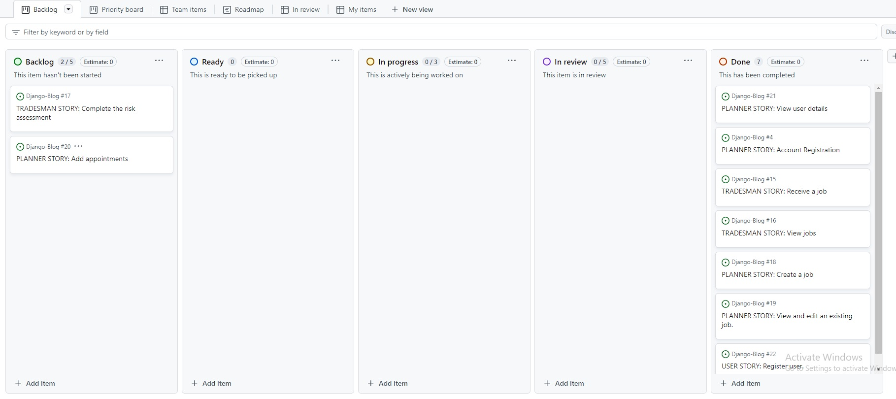

[Return to contents list](#contents)

### Future Features
#### Risk Assessment
Further development of this project will mean that a tradesman can create, read, update and delete a risk assessment attached to each task, this allows for safe working practices for the tradesman.

#### Add appointments
This feature will allow the planners to create, read, update and delete items on a calendar that is unique to each user. This enables the jobs to be planned and for estimated completion dates added to each task and job.

[Return to contents list](#contents)

## Languages

HTML
CSS
JavaScript
Python

[Return to contents list](#contents)

## Frameworks and Libraries

[Django 3.2](https://www.djangoproject.com) - A high-level Python web framework that encourages rapid development and clean, pragmatic design.

[Gunicorn 21.2](https://gunicorn.org) - A Python WSGI HTTP Server for UNIX.

[Psycopg2 2.9](https://www.psycopg.org/docs/#) - A PostgreSQL database adapter for the Python programming language.

## Tools and Technologies

Tools and technologies are listed in order of use during the development of this project.

[Code Institute Template](https://github.com/Code-Institute-Org/ci-full-template) - Provided me with a familiar base from which to build my project.

[GitHub](https://github.com/) - Stores the repository for this project so that it can be viewed by others.

[git](https://git-scm.com/) - Controlled the building of this project in a series of versions which can be tracked.

[Visual Studio Code](https://code.visualstudio.com/) - One of the two editors in which this project has been built. The following extentions were installed and used: Markdown Preview Enhanced, Python, Pylance, Tailwind CSS IntelliSense

[Cloudinary](https://cloudinary.com) - Image and video API platform.

[Heroku](https://www.heroku.com) - Used to host and deploy the project.

[ElephantSQL](https://www.elephantsql.com) - Used to store the PostgreSQL database.

[WebAim contrast checker](https://webaim.org/resources/contrastchecker/) - Used to test contrast between text and background.

[ChatGPT](https://chat.openai.com/) - ChatGPT was used to help resolve project bugs. ChatGPT was also used on occasion when repetitive tasks are to be completed.

[Jshint](https://jshint.com/) - Used to validate the JavaScript code.

[W3C - CSS Validation Service](https://jigsaw.w3.org/css-validator/) - Used to validate the CSS code.

[CI Python Linter](https://pep8ci.herokuapp.com/) - Used to validate the Python code.

[Nu HTML Checker](https://validator.w3.org/nu/) - Used to validate the HTML code.

[Return to contents list](#contents)

## Bugs and Fixes

See [bugs.txt](bugs.txt)

[Return to contents list](#contents)

## Testing

### Manual testing
The website was manually tested on the front-end by myself, and a group composed of my family and friends for the following categories.

1. **Browser compatibility**: Manually test the website on multiple browsers (Chrome, Firefox, Safari, Edge etc.) to ensure compatibility.

2. **Responsiveness**: Check the website's responsiveness on different device resolutions. Ensure elements resize and reposition correctly when the browser is resized.

3. **Forms**: Test all forms by filling out the inputs and submitting them. Check validation for each input, including tests for incorrect input.

4. **Navigation**: Ensure that all navigation links direct to the correct page. Manually click on each link and button to confirm.

5. **Performance**: Manually measure load times and latency.

6. **User Authentication**: Validate the login and sign-up functionalities to work properly, including error messages for incorrect replies.

7. **Error Messages**: Check if appropriate error messages are displayed for different scenarios.

8. **Data Integrity**: If data manipulation operations are performed, ensure the database is accurately updated.

#### As a User
| What was tested                                       | Expected Result                                                       | Outcome |
|:------------------------------------------------------|:----------------------------------------------------------------------|:-------:|
| Click on the "login" button.                          | Redirect to the login page                                            | Passed  |
| Click on the "sign-up" button.                        | Redirect to the sign up page                                          | Passed  |
| Click on the "sign-out" button.                       | Redirect to the sign out page, followed by the user being signed out. | Passed  |
| Click view profile                                    | Redirected to a page showing the user's details.                      | Passed  |
| Click edit button on either card on the profile page. | Should open a model which will have the current details prefilled.    | Passed  |

#### As a Tradesman
| What was tested                                       | Expected Result                                                    | Outcome |
|:------------------------------------------------------|:-------------------------------------------------------------------|:-------:|
| Click on the "Enter as Tradesman" button.             | Redirect to the Tradesman home page.                               | Passed  |
| Click on a job card.                                  | Redirect to the Job Detail page.                                   | Passed  |
| Click on the edit task button.                        | The form should appear with the task details already inputted.     | Passed  |
| Click on the edit button to submit the form.          | The task data will update as per changes on the form.              | Passed  |
| Click the cancel button. (For add and edit task)      | The form should close, with no details being changed.              | Passed  |
| Click the delete task button.                         | The task should be removed from the list.                          | Passed  |
| Click the add task button.                            | The form to add a new task should appear.                          | Passed  |
| Click the submit button.                              | The new task should display on the tasks section.                  | Passed  |
| Click edit on the contact details.                    | A form should appear with the customers contact details prefilled. | Passed  |

#### As a Planner
| What was tested                                  | Expected Result                                                             | Outcome |
|:-------------------------------------------------|:----------------------------------------------------------------------------|:-------:|
| Click on the "Enter as Planner" button.          | Redirect to the planner home page                                           | Passed  |
| Click on a job entry on the jobs table.          | Redirect to the Job Detail page.                                            | Passed  |
| Click on the edit task button.                   | The form should appear with the task details already inputted.              | Passed  |
| Click on the edit button to submit the form.     | The task data will update as per changes on the form.                       | Passed  |
| Click the cancel button. (For add and edit task) | The form should close, with no details being changed.                       | Passed  |
| Click the delete task button.                    | The task should be removed from the list.                                   | Passed  |
| Click the add task button.                       | The form to add a new task should appear.                                   | Passed  |
| Click the submit button.                         | The new task should display on the tasks section.                           | Passed  |
| Assign a tradesman through the drop down.        | The drop down should display, showing the tradesmen with the correct trade. | Passed  |
| Click submit to assign tradesman.                | The tradesman should appear to the right of the drop down.                  | Passed  |
| Click edit on the contact details.               | A form should appear with the customers contact details prefilled.          | Passed  |
| Clicking add user button on the Planner Home.    | Redirect to the add_user page.                                              | Passed  |
| Submitting the add user form.                    | Redirect to planners home, and add a new user to the user list.             | Passed  |
| Incorrectly filling out any form.                | Should mark the failed field and tell the user what needs to be corrected.  | Passed  |
| Click Edit Job or Add job button.                | Should open the form, prefilled if the edit button was clicked.             | Passed  |
| Clicking add or edit button on the Job form.     | Should update the database and the changes or addition should be displayed. | Passed  |

### Automated testing
When automating testing, I used a Python standard library module: unittest.

This was done by creating a test file for each file that was being tested within each app. For example, in the products app, a test case was created to test the views and forms used within the app.

Within each file there is a test case, which runs all the test within the case. Each test case has a set up function, which creates a test instance of any model the test might need. This prevents the database actually being manipulated whilst running tests.

Throughout this project I ran the tests multiple times as I went, fixing all the errors and failures whenever they present themselves. This helped to ensure nothing was missed in the functionality of the website.

#### Testing views
When creating a views test, I would first check the correct status code was returned which shows the page is being loaded correctly.

After this I will look at each view, and what the aim of the view was.

For example, on the user_detail view, the aim was to display a page that shows all of the chosen users' details, as well as being able to edit the users details if required.

To test this example, I first created a test user in the test case setup. Then I tested if the page would render, if the correct template was used, and if the test users first name was contained in the responses content.

#### Testing Forms

All form validations are thoroughly tested to verify correct error messages are displayed for invalid user inputs.

#### Running Tests
You can run the test suite with the following command in your terminal:
_python3 manage.py test_

You can also run tests on specific apps on:
_python3 manage.py test <APP NAME>_

The last time tests were run, there were no errors or fails.

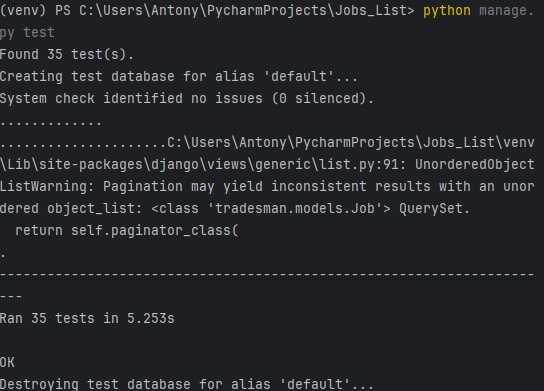

## Validation
The validators I used for this project are all referenced in the [Tools and Technologies](#tools-and-technologies) section above.
For each validator, I corrected any error or warning that was returned, unless stated below in the ignored warnings section.

### Ignored warnings
#### PyCharm's built in Problem identifier:

| File                                          | Warning                                                                                                       |                                                                                     Reason for ignoring                                                                                      |
|:----------------------------------------------|:--------------------------------------------------------------------------------------------------------------|:--------------------------------------------------------------------------------------------------------------------------------------------------------------------------------------------:|
| planners/view.py                              | Local variable 'new_user_form' might be referenced before assignment.                                         |                                                       This warning can be ignored as the form variable is set within an if statement.                                                        | 
| static/css/style.css                          | Duplicated code fragment (106 lines long)                                                                     |                                      The duplicated code is the file that is stored in the staticfiles directory, which is used for the deployed site.                                       |
| static/js/script_job_detail.js (3 Warnings)   | Unresolved variable or type bootstrap and Unresolved type Modal and Unresolved variable or type deleteConfirm |                                                 These warnings can be ignored as PyCharm just doesn't recognise what the instances are for.                                                  |
| static/js/script_planner_home.js (3 Warnings) | Unresolved variable or type bootstrap and Unresolved type Modal and Unresolved variable or type deleteConfirm |                                                 These warnings can be ignored as PyCharm just doesn't recognise what the instances are for.                                                  |
| static/js/script_planner_home.js              | Duplicated code fragment (13 lines long)                                                                      |                                      The duplicated code is the file that is stored in the staticfiles directory, which is used for the deployed site.                                       |
| templates/base.html (3 Warnings)              | Missed locally stored library for HTTP link                                                                   |                                                   The warnings are not applicable because the files are not required to be locally stored.                                                   |
| tradesman/models.py                           | Local variable 'tradesman' value is not used                                                                  |                                                   This warning can be ignored as the tradesman variable doesn't require being referenced.                                                    |
| tradesman/views.py                            | Local variable 'contact_details_form' might be referenced before assignment                                   |                                                       This warning can be ignored as the form variable is set within an if statement.                                                        |
| main/models.py                                | Parameter 'sender' value is not used                                                                          |                         The sender parameter is needed because the post_save signal will be sent by the User model itself after a save occurs on an instance of it.                          |
| main/models.py                                | Parameter '**kwargs' value is not used                                                                        | The **kwargs parameter is used to capture all other keyword arguments that are not explicitly defined in the function, preventing a TypeError if an unexpected keyword argument is received. |

#### W3C Nu Html Checker:
Due to the requirement for the user to be logged into the website for it to load, I had to copy and paste each file into the validator as text.
This returned multiple errors that only related to the lack of support for DJango by the validators. For example, each template tag returned an error when used in an HREF.
All of these warnings and errors were ignored, and no further warnings were presented.

#### W3C CSS Validation Service
No errors were found.

#### CI Python Linter
No errors were found.

## Deployment

This website has been deployed using Heroku.

Instructions to deploy using Heroku:

1 - While in Heroku, navigate to dashboard and then click on the new button in the top right corner choosing: create new app.

2 - Input a name for your app (this name will need to be unique) and choose the correct region for where you are located. Click create app.

3 - Your app has been created, now click on the settings tab.

4 - Click reveal config vars to add any keys the application will need. For this project I added:
- All the key value pairs from my env.py file.

5 - Click add buildpack to install any interdependecies needed. For this project I installed 'python'.

6 - Click on deploy tab. Select deploy method, in this case Git Hub. Confirm connection to git hub by searching for the correct repository and then connecting to it.

7 - To manually deploy project click 'Deploy Branch'. Once built a message will appear saying: Your app was successfully deployed. Click the view button to view the deployed page making a note of it's url.

8 - You can also set up automatic deployment.

9 - If you find your css is not showing correctly on the deployed site running the following command while in your workspace may help:
./manage.py collectstatic

10 - Don't forget to turn Debug back to False before final deployment.

[Return to contents list](#contents)

## Cloning this repository

In order to work on this repository you will first need to clone it.

**Instructions to clone the repository**:

1 - While in the GitHub repository, click on the green code button.

2 - Copy the link.

3 - In your IDE or local coding environment use the link to open the repository. 

For example: in VScode 
- clicking on 'Clone Git Repository...' will bring up a box in which to paste the link. 
- once vscode has the link, you will then be asked where you would like the repo saving.
- You should now be set up ready to work on the repository.

For example: in CodeAnywhere
- Click on 'Add new workspace'
- You will then be given the option to 'Create from your project repository' and a box in which to paste the link
- CodeAnywhere will now open a new workspace containing the repository.
- You should now be set up ready to work on the repository.

4 - Import all dependencies. I use the command: pip3 install -r requirements.txt.

5 - Create an env.py file in the main directory.

6 - Enter key data, such as: DATABASE_URL, SECRET_KEY, CLOUDINARY_URL

7 - Check that env.py is named in the .gitignore file.

8 - In settings.py change Debug to True while developing. You make also want to change to Django's inbuilt sqlite database.

9 - Add the following code to settings.py:

COMPRESS_ROOT = BASE_DIR/ 'static'

COMPRESS_ENABLED = True

STATICFILES_FINDERS = ('compressor.finders.CompressorFinder',)

9 - Check it's all working by running the program. I used the command:
python3 manage.py runserver

[Return to contents list](#contents)

## Forking a branch

In order to protect the main branch while you work on something new, essential when working as part of a team or when you want to experiment with a new feature, you will need to fork a branch. 

**Instructions to fork the repository**:

1 - While in the GitHub repository, click on the branch symbol and text indicating the number of branches.

2 - This will load details on current branches. Click on the green 'New branch' button.

3 - Enter a name for the new branch and then click the green 'create new branch' button.

4 - Your new branch should now have appeared on the screen.

5 - Clicking on the new branch and then following the steps for cloning will allow you to open up and work on this branch.

**Instructions to fork directly from an issue**:

1 - Click to view an issue, either from the issues list or from the project board. From the project board you will need to click once to bring up the issue and then again on the title to go into it fully.

2 - Partway down the right hand side (on desktop) you should see the heading 'Development' and under this a link to 'create a branch for this issue or link a pull request'.

3 - Click on the link to create a forked branch that is tied to the issue.

[Return to contents list](#contents)

## Credits

### Code

[Code Institute](https://codeinstitute.net) - "I think therefore I Blog" walkthrough followed when installing dependencies and deploying to Heroku.
[Multi Select Field](https://pypi.org/project/django-multiselectfield/)multi select field 

### Wireframes
[Visily](https://www.visily.ai/) The wireframes were created on Visily.
